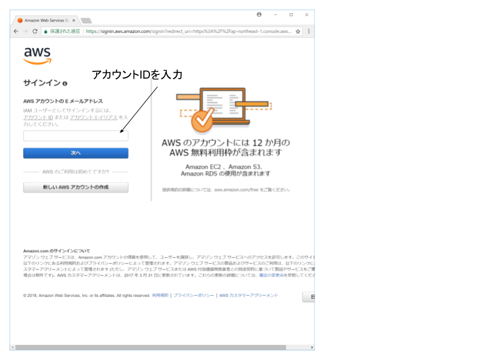
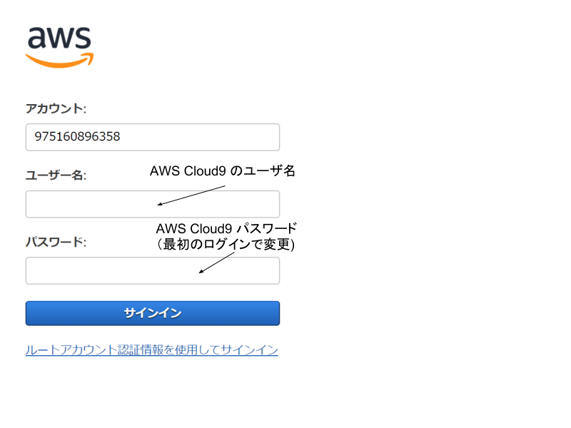
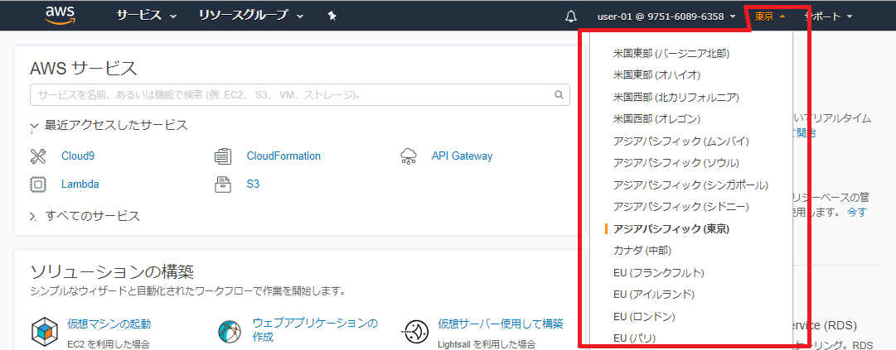
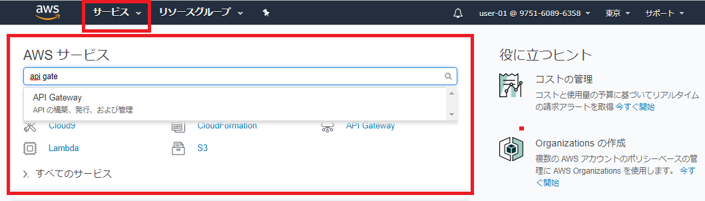
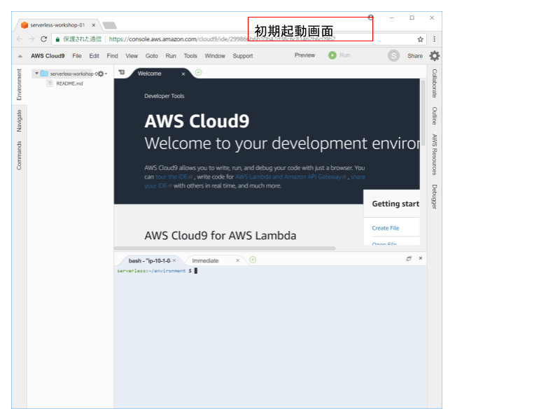
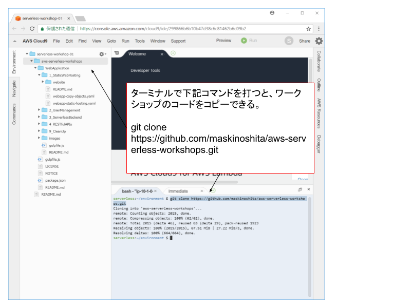

# Module 0: First Setup

このワークショップではAWSを利用します。
また開発環境にはクラウドIDEであるAWS Cloud9 を使用します。

このモジュールではAWSおよびAWS Cloud9の使い方について説明します。

## AWSへのログイン

Chromeブラウザで下記にアクセスしてください。
https://console.aws.amazon.com/

指定されたAWSアカウントID, ユーザID, 初期パスワードを入力してください。
パスワードの設定を促されたら、8文字以上で任意のパスワードを再設定してください。





AWS コンソールの右上にあるリージョンの設定から**東京**(ap-northeast-1)を選択しておいてください。



コンソールのトップ画面の**AWS サービス**カード、または上部のナビゲーションの**サービス**から各種サービスにアクセスできることを確認しておいてください。



## Cloud9へのログイン

Chromeブラウザで新しいタブを開き、
指定されたCloud9のURLにアクセスしてください。

ログイン画面が表示され場合、
ユーザID、パスワードを入力してください。

Cloud9はEclipseのようなプログラミングで使用する開発IDEと同じ見た目をしています。



Cloud9 は AWS環境上のEC2マシンで動作しており、右下のターミナルを通して直接マシン上でコマンドを実行させられます。
それを利用して、開発環境上にワークショップのリポジトリをダウンロードします。

ターミナルで下記のコマンドを入力してください。
```bash
git clone https://github.com/maskinoshita/aws-serverless-workshops.git
```




## ワークショップの手順の確認

このリポジトリに含まれる各モジュールのREADME.mdに従って、ワークショップを進めてください。
README.mdによる内容確認は、GitHub上から参照するほうが正しいフォーマットで表示されるため便利です。

https://github.com/maskinoshita/aws-serverless-workshops.git


AWS, AWS Cloud9へのログインができたら [StaticWebHosting](../1_StaticWebHosting) に進んでください。